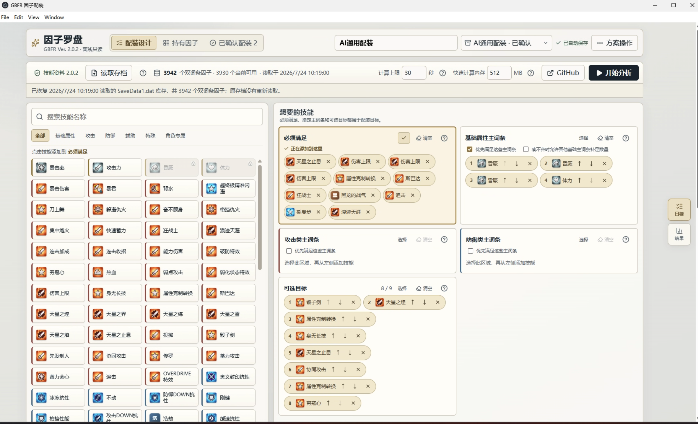
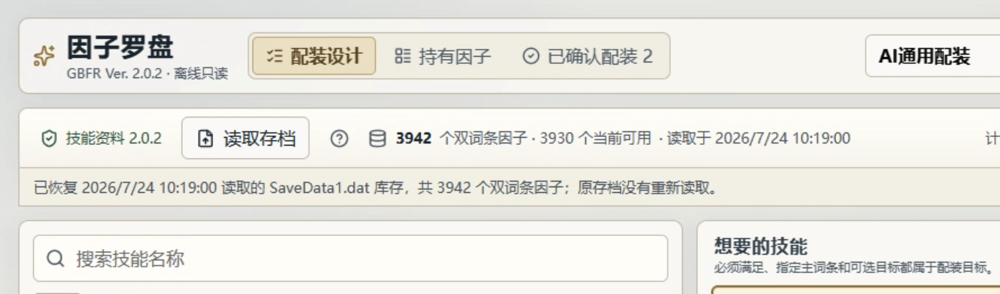
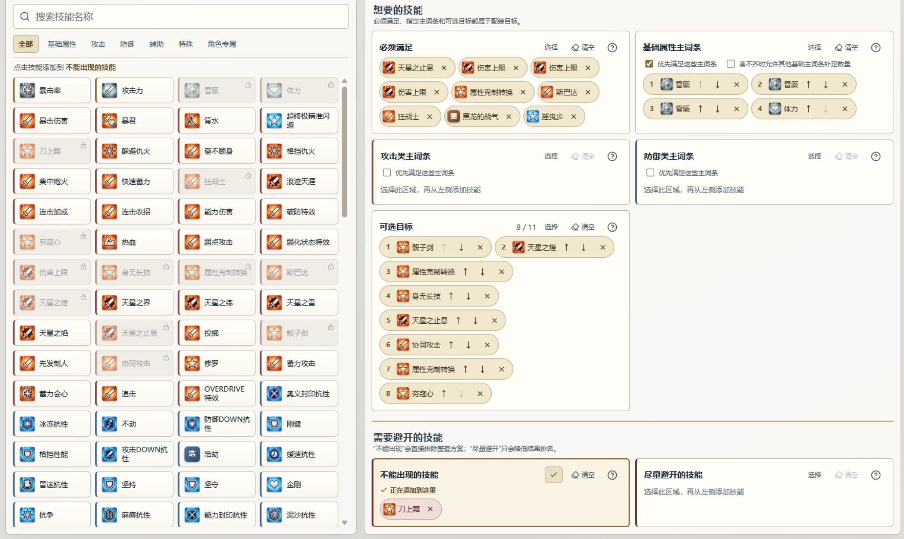
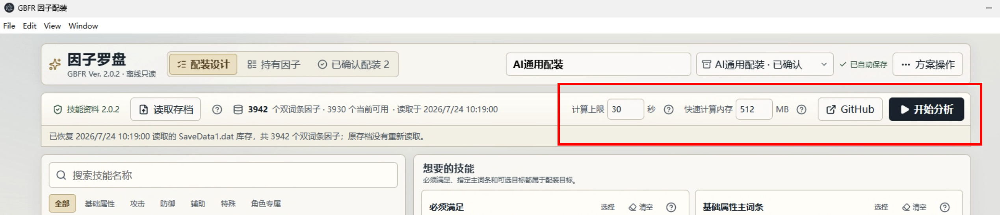
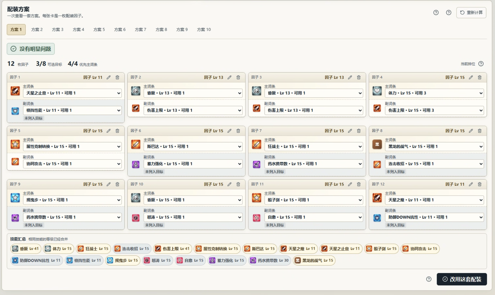
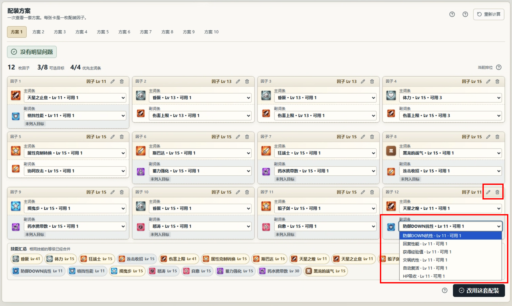
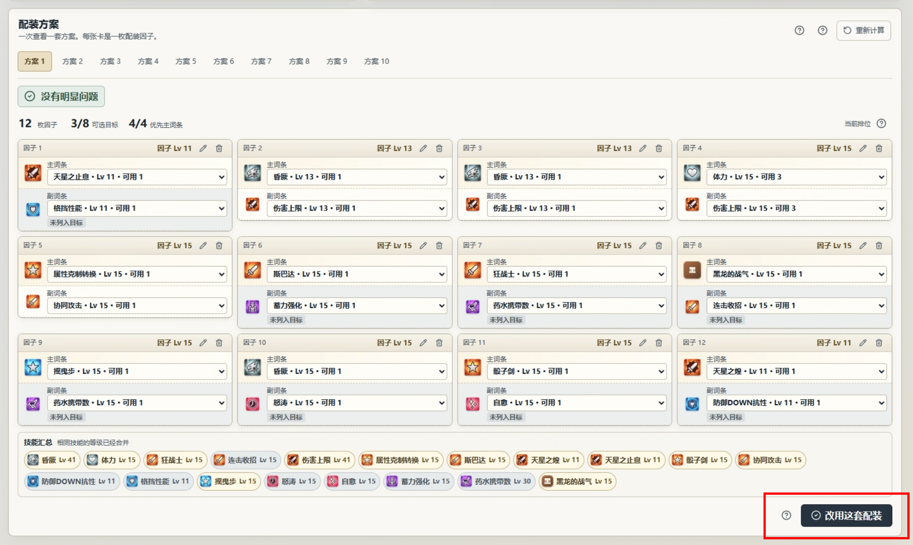
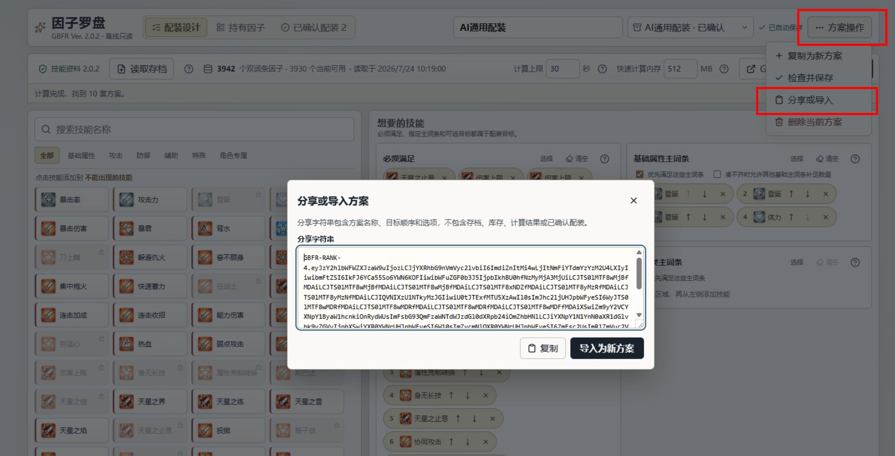
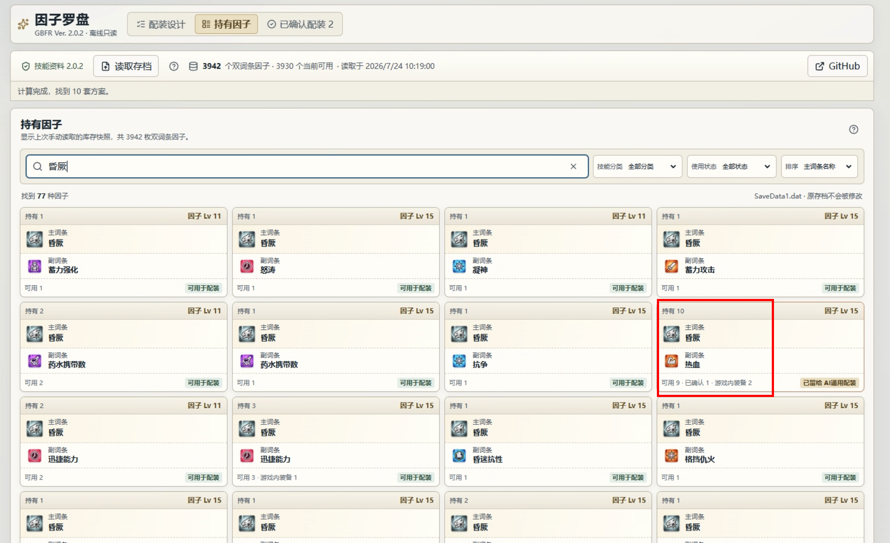
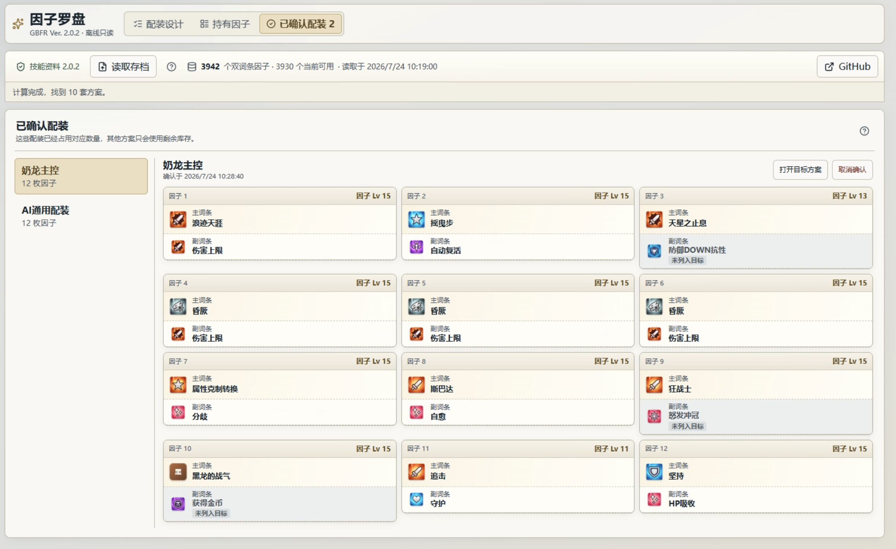

# 因子罗盘（Sigil Compass）

[](LICENSE)

《碧蓝幻想 Relink》V+ 因子配装工具。它会只读解析本地存档，根据现有库存计算配装方案，适合因子较多、不想逐页翻找的玩家。

> 当前测试版为 Windows x64 `v0.3.0-beta.1`；稳定版为 `v0.2.3`。项目是非官方玩家工具，与 Cygames、发行商及平台方无关。

## 使用教程

### 1. 下载并启动

1. 打开 [Releases](https://github.com/SalmonC/gbfr-sigil-compass/releases)，下载 `Sigil-Compass-0.3.0-beta.1-win-x64-portable.zip`。
2. 将压缩包完整解压到普通文件夹，不要直接在压缩包内运行。
3. 双击 `Sigil-Compass.exe`。

当前程序没有商业代码签名，Windows 可能弹出 SmartScreen 提示。请先确认文件来自本仓库 Release，并用同一 Release 中的 `SHA256SUMS.txt` 核对哈希。

应用不会修改存档，也不会自动备份。第一次使用前，建议手动复制一份 `SaveData*.dat`。



### 2. 读取存档

点击顶部的“读取存档”，选择需要分析的 `SaveData*.dat`。Windows 默认存档目录是：

```text
%LOCALAPPDATA%\GBFR\Saved\SaveGames\
```

如果文件选择窗口没有打开该目录，可以按 `Win + R`，粘贴上面的路径后回车。通常选择 `SaveData1.dat`；如果有多个同名文件，选择修改时间最新的一个。

读取成功后，顶部会显示双词条因子总数和当前可用数量。工具读取的是当前库存的快照，游戏内获得、强化或分解因子后，需要重新读取存档。



### 3. 设置配装目标

先点击右侧要编辑的目标区域，再从左侧技能池选择技能。可以搜索技能或切换分类；删除目标时，点击技能旁的“×”。

目标分为以下几类：

- **必须满足**：所选技能必须全部出现，否则不显示方案。同一技能可以重复添加，例如需要 3 条追击，就添加 3 次追击。
- **基础属性主词条**：要求技能出现在因子的第一个词条。允许替代后，还可以设置可接受的基础属性和替代顺序。
- **攻击类主词条 / 防御类主词条**：指定相应分类的技能作为因子主词条。
- **可选目标**：工具会尽量满足，顺序越靠前越重要，可以用上下按钮调整顺序。
- **不能出现的技能**：任意因子带有所选技能时，整套方案都会被排除。
- **尽量避开的技能**：方案仍然可以出现，但排名会降低，并在结果中标出。

不可选择的技能会变灰，鼠标移上去可以查看原因。每个目标区域右上角都有单独的“清空”按钮。

一个简单的配置是“3 追击 + 3 伤害上限”：在“必须满足”中分别添加 3 次追击和 3 次伤害上限，工具会从现有库存中寻找能够凑齐这些技能的因子组合。



### 4. 开始分析

读取存档并至少设置一个目标后，点击“开始分析”。完成后，页面会自动跳到结果区，最多显示排名前 10 的逻辑方案。



### 5. 查看计算结果

结果标签用于切换不同方案。每枚因子卡片会显示主词条、副词条、因子等级和技能图标；不在目标中的附带词条会弱化显示，“尽量避开”或替代主词条等情况会使用警告色说明。

因子列表下方会按技能汇总实际等级，例如两条 15 级追击显示为“追击 Lv 30”。技能按照基础属性、攻击、防御、辅助/特殊、角色专属排列。

技能组合相同但等级不同的因子属于同一逻辑方案，实际选取时会优先使用高等级实例。`A&B` 与 `B&A` 的主词条不同，因此会作为两种方案。



### 6. 按库存手动调整

结果中的主、副词条都可以调整，但候选始终来自真实的可用库存：

1. 修改副词条时，主词条保持不变，只显示主词条相同的可用因子。
2. 修改主词条时，副词条保持不变，只显示副词条相同的可用因子。
3. 卡片右上角可以更换或删除整枚因子；当前方案不足 12 枚时，还可以继续添加。

每个候选都会显示因子等级和可用数量。调整后，目标完成情况、警告和技能等级汇总会立即更新，原来的前十名排序不会改变。也可以点击“恢复计算结果”，撤销当前方案下的全部手动修改。

如果调整后缺少“必须满足”的技能，或加入了“不能出现”的技能，这套配装将无法确认。



### 7. 确认并应用配装

选好结果后，点击“确认配装”。工具会按主词条、副词条、等级和数量记录这套方案使用的因子；之后为其他角色计算时，已经占用的数量会从可用库存中扣除。

工具只读取库存、计算方案，不会把配装写回存档。确认后仍需按照因子卡片中的结果进入游戏手动装备。



### 8. 保存并分享目标方案

方案名称、目标顺序和最近一次结果会自动保存在本机。需要分享时，在“方案操作”中导出分享字符串；其他玩家导入后，可以使用自己的库存重新计算。

分享字符串不包含存档路径、库存或玩家身份。游戏内库存发生变化后，重新读取存档，再明确点击“重新计算”即可更新结果。



更完整的操作说明见 [使用说明](docs/user-guide.md)，启动、存档和计算问题见 [故障排查](docs/troubleshooting.md)。

## 功能介绍

下面只列出主流程之外的辅助模块。

### 持有因子

“持有因子”页面会合并主词条、副词条和等级完全相同的因子，并显示持有、可用和已确认数量。可以搜索主副词条，也可以按分类、可用状态、游戏内装备状态和等级筛选或排序。



### 方案管理

顶部下拉框可以切换多个命名方案。“方案操作”还支持复制当前方案、检查并保存，以及删除不再需要的方案。修改名称不会让结果失效；目标、库存或占用发生变化后，旧结果会标记为需要重新计算。

### 已确认配装

“已确认配装”页面可以集中查看或取消各角色占用。重新读取存档后，如果某类因子的持有数量不足，相关配装会标记为需要检查；工具不会擅自替换因子或决定优先保留哪套配装。



### 计算资源设置

默认计算上限为 30 秒，快速算法使用 512 MB 内存预算。计算时间可以设为 5–600 秒，快速计算内存可以设为 128–2048 MB。达到内存预算后会自动切换为低内存精确算法，不会返回近似结果。

完整排序规则见 [配装匹配与排序规格](docs/architecture/ranking-specification.md)。

## 隐私与本地数据

- 存档、库存和方案不会上传，应用运行时不需要联网。
- 读取时先创建私有临时副本，解析完成后删除；原存档不会交给可写组件。
- 应用会保存解析后的因子清单、最近一次存档路径、方案和已确认配装，但不会保存存档副本。
- 启动时只恢复上次的库存快照，不会自动重读存档。游戏内库存改变后，需要手动点击“读取存档”。

具体保存内容和清理方法见 [隐私说明](PRIVACY.md)。

## 当前限制

- 技能目录以 GBFR Ver. 2.0.2 为基线，游戏更新后可能需要同步数据。
- 只考虑带两个技能的 V+ 因子。
- 每次最多显示排序后的前 10 套逻辑方案。
- 单次计算默认上限为 30 秒；可设为 5–600 秒。快速算法默认使用 512 MB 切换预算，可设为 128–2048 MB；达到预算后自动切换到低内存精确算法，不返回近似结果。
- 当前 Electron 便携包约 173 MB，解压后约 426 MB。Windows-only 的 Tauri 2 + Rust 轻量版正在迁移，目标是在功能和界面不回退的前提下显著缩小体积。
- 当前版本未做 Windows 原生代码签名，也没有自动更新功能。

## 开发

环境版本由 `.node-version`、`global.json` 和 `desktop/package-lock.json` 固定。

```bash
./eng/verify.sh
cd desktop
npm ci
npm run verify:release
```

真实存档测试必须把文件放在仓库外：

```bash
GBFR_TEST_SAVE=/path/to/SaveData1.dat npm run test:engine-import
GBFR_SAVE_FIXTURE_DIR=/path/to/SaveGames npm run test:save-fixtures
```

Windows 发行包：

```bash
cd desktop
npm run make:win-x64
```

架构入口见 [docs/architecture/README.md](docs/architecture/README.md)。Tauri 重构决策见 [ADR-0011](docs/architecture/adr/0011-windows-tauri-rust-rewrite.md)。

## 反馈

遇到问题请先阅读 [故障排查](docs/troubleshooting.md)，再提交 Issue。不要在公开 Issue 中上传存档；建议附上系统版本、应用版本、操作步骤、错误提示和经过遮挡的截图。

安全问题请按 [SECURITY.md](SECURITY.md) 私下报告。

## 权利说明

本项目的原创代码和文档采用 [MIT License](LICENSE)，允许使用、修改、分发和商业使用，但须保留版权与许可声明。

《碧蓝幻想 Relink》的名称、技能名称、数据、图标及其他第三方内容不属于 MIT 授权范围，仍归各自权利人所有。素材来源和处理边界见 [NOTICE.md](NOTICE.md)。
