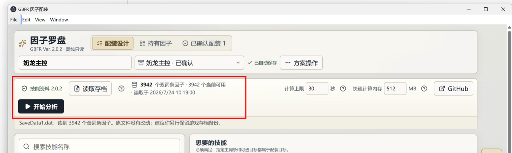
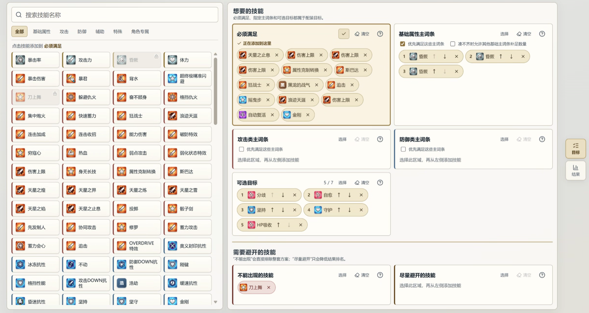
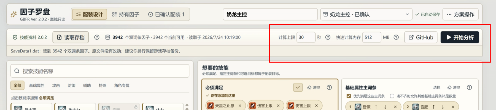

# 因子罗盘（Sigil Compass）

[](LICENSE)

《碧蓝幻想 Relink》V+ 因子配装工具。它会只读解析本地存档，根据现有库存计算配装方案，适合因子较多、不想逐页翻找的玩家。

> 当前公开版为 Windows x64 `v0.2.3`。项目是非官方玩家工具，与 Cygames、发行商及平台方无关。

## 主要功能

- 直接读取 `SaveData*.dat`，自动整理持有的双词条因子。
- 设置必须满足、可选目标，以及基础、攻击、防御类主词条。
- 将不想要的技能分为“不能出现”和“尽量避开”。
- 按目标完成情况、屏蔽技能、因子数量和等级等规则计算前 10 套方案。
- 保存和分享命名方案；更新库存后可以重新计算。
- 查看全部持有因子，并按技能、分类、等级和占用状态筛选。
- 确认角色配装后，按词条组合、等级和数量占用库存，避免重复使用。
- 在计算结果中替换主、副词条，或添加、删除、更换整枚因子。
- 汇总整套配装的技能等级，并标出不在目标中的附带词条。

完整排序规则见 [配装匹配与排序规格](docs/architecture/ranking-specification.md)。

## 下载与运行

1. 打开 [Releases](https://github.com/SalmonC/gbfr-sigil-compass/releases)，下载 `Sigil-Compass-0.2.3-win-x64-portable.zip`。
2. 解压到普通文件夹，不要直接在压缩包内运行。
3. 双击 `Sigil-Compass.exe`。

当前程序没有商业代码签名，Windows 可能弹出 SmartScreen 提示。请确认文件来自本仓库 Release，并用同一 Release 中的 `SHA256SUMS.txt` 核对哈希。

## 使用教程

### 1. 备份并读取存档

应用不会修改存档，也不会自动备份。第一次使用前，建议先把 `SaveData*.dat` 复制到其他文件夹留作备份。

点击顶部的“读取存档”。Windows 默认存档目录是：

```text
%LOCALAPPDATA%\GBFR\Saved\SaveGames\
```

如果文件选择窗口没有自动打开该目录，可以按 `Win + R`，粘贴上面的路径后回车。

通常选择 `SaveData1.dat`。如果有多个 `SaveData*.dat`，请选择修改时间最新的文件。读取成功后，顶部会显示双词条因子总数和当前可用数量。

工具读取的是当时的库存快照。游戏内获得、强化或分解因子后，需要再次点击“读取存档”才能更新。



### 2. 选择要编辑的目标

页面左侧是技能池，右侧是各类配装目标。操作顺序是：

1. 点击右侧一个目标区域，使其进入选中状态；
2. 在左侧搜索或切换分类；
3. 点击技能，将它加入当前目标；
4. 删除时点击右侧目标中技能旁的“×”。

同一技能能否重复添加，取决于目标类型。不可选择的技能会变灰，鼠标移上去可以查看原因。每个目标区域右上角都有单独的“清空”按钮。



### 3. 设置想要的技能

- **必须满足**：所选技能必须全部出现，否则不显示方案。同一技能可以重复添加。例如需要 3 条追击，就添加 3 次追击。
- **基础属性主词条**：要求技能出现在因子的第一个词条。允许替代后，可以设置接受哪些基础属性，以及替代顺序。
- **攻击类主词条 / 防御类主词条**：指定相应分类的技能作为因子主词条。
- **可选目标**：工具会尽量满足，顺序越靠前越重要。可以用上下按钮调整顺序。

“必须满足”和启用优先满足的主词条目标会先于可选目标处理。总目标受 12 个因子槽、最多 24 个技能词条限制；可选目标标题旁的问号会说明当前上限。

一个常见的简单配置是“3 追击 + 3 伤害上限”：在“必须满足”中分别添加 3 次追击和 3 次伤害上限。工具会根据库存寻找能够同时凑齐这些技能的因子组合。

### 4. 设置需要避开的技能

- **不能出现的技能**：所选因子的主词条或副词条只要带有该技能，整套方案就会被排除。适合刀上舞等不接受的副作用词条。
- **尽量避开的技能**：方案仍然可以出现，但排名会降低，并在结果中标出。

同一技能不能同时出现在两个屏蔽区域，也不能与其他互斥目标重复选择。

### 5. 开始分析

读取存档并至少设置一个目标后，点击“开始分析”。计算在独立 Worker 中进行，不会占用界面线程。

分析完成后，页面会自动跳到结果区。最多显示排名前 10 的逻辑方案；可以通过结果上方的标签切换。

顶部可以分别调整计算时间和“快速计算内存”。默认最多运行 30 秒，快速算法使用 512 MB 预算；可设为 128–2048 MB。达到该值后，工具会自动切换到更省内存的精确算法，计算可能变慢，但不会仅因组合数量太多而停止。

只有达到时间上限时，计算才会停止，并且不会把未算完的结果当作最优方案。复杂配置可以提高时间上限；增加必须满足或“不能出现”的技能通常也能缩小搜索范围，但不是成功计算的前提。



### 6. 阅读结果

每枚因子卡片会显示：

- 主词条和副词条；
- 因子等级；
- 对应的技能图标；
- 是否出现替代主词条或“尽量避开”的技能；不在目标中的附带词条会用灰色标出。

因子列表下方按技能汇总实际等级，例如两条 15 级追击显示为“追击 Lv 30”。技能按基础属性、攻击、防御、辅助/特殊、角色专属排列。页面不再显示所有因子的等级总和。

不在任何目标中的附带词条使用灰色背景。“尽量避开”、替代主词条等问题仍使用警告色，结果标签和因子列表上方会说明原因。

技能组合相同但等级不同的因子属于同一逻辑方案，实际选取时会优先使用高等级实例。`A&B` 与 `B&A` 的主词条不同，因此算作两种方案。目标外副词条只有位于相同主词条位置时才会合并，避免丢失不同的手动替换范围。

结果标签变红时，表示该方案存在需要注意的情况。切换过去后，因子列表上方会说明具体原因。

<!-- 截图位置 4：一套完整结果，要拍到方案标签、问题提示、因子卡、灰色附带词条和底部技能汇总。建议文件：docs/images/readme/04-result-overview.png -->

### 7. 手动调整计算结果

因子卡中的主词条和副词条都是选择框：

1. 修改副词条时，主词条保持不变，只列出具有相同主词条的可用因子；
2. 修改主词条时，副词条保持不变，只列出具有相同副词条的可用因子；
3. 每个选项会显示技能、因子等级和可用数量，例如“可用 3”。

主、副词条和等级完全相同的因子会合并显示，后台按实际数量扣减。同词条但等级不同的因子仍分开列出。

<!-- 截图位置 5：展开某个主词条或副词条选择框，画面要能看到等级和“可用 N”。建议文件：docs/images/readme/05-trait-replacement.png -->

#### 更换、删除或添加整枚因子

卡片右上角的铅笔按钮用于更换整枚因子，垃圾桶按钮用于删除。当前方案不足 12 枚因子时，列表末尾会出现“添加因子”。

替换窗口按主词条、副词条和因子等级合并相同库存，并显示当前可用数量。候选会扣除当前方案已经使用的数量，以及其他已确认配装占用的数量。

修改后，目标完成情况、警告和技能等级汇总会立即更新，但原来的前十名排序不会改变。页面会标记“手动调整版”，也可以点击“恢复计算结果”撤销当前方案下的全部手动修改。如果调整后缺少必须满足的技能，或加入了“不能出现”的技能，这套配装不能确认。

<!-- 截图位置 6：打开“更换整枚因子”窗口，画面要能看到合并后的候选和“可用 N”。建议文件：docs/images/readme/06-factor-replacement.png -->

### 8. 保存、分享和重新计算

方案名称、目标和最近一次结果会自动保存在本机。顶部下拉框可以切换多个方案；“方案操作”中可以：

- 复制为新方案；
- 检查并保存；
- 导出分享字符串；
- 导入别人分享的配置；
- 删除当前方案。

分享字符串会包含方案名称、目标顺序和相关选项，不包含存档路径、库存或玩家身份。

计算成功后会缓存原始前十名，以及每个结果对应的手动调整版。重新读取发生变化的库存、修改计算目标或重新分析时，旧结果会失效或被替换，不会一直累积历史计算文件。

### 9. 多角色配装

查看结果时，可以点击“确认配装”。工具会按主词条、副词条和因子等级记录所需数量，不会占用整类因子。

手动调整过的方案会按调整后的组合和数量确认。为其他角色计算时，已占用数量会从可用库存中扣除。“已确认配装”页面可以集中查看和取消占用。重新读取存档后，如果某类因子的持有数量不足，相关配装会标为需要检查。

<!-- 截图位置 7：“已确认配装”页面，同时展示两套不同角色配装及数量占用。建议文件：docs/images/readme/07-confirmed-loadouts.png -->

### 10. 查看持有因子

“持有因子”页面会合并主、副词条和等级完全相同的因子，并显示持有、可用和已确认数量。可以搜索主副词条，并按分类、可用状态、游戏内装备状态和等级筛选或排序。这里显示的是最近一次手动读取后的快照，不是游戏内实时库存。

<!-- 截图位置 8：“持有因子”页面，展示搜索、筛选、合并数量和占用状态。建议文件：docs/images/readme/08-inventory-page.png -->

更完整的说明见 [使用说明](docs/user-guide.md)，启动、存档和计算问题见 [故障排查](docs/troubleshooting.md)。

## 隐私与本地数据

- 存档、库存和方案不会上传，应用运行时不需要联网。
- 读取时先创建私有临时副本，解析完成后删除；原存档不会交给可写组件。
- 应用会保存解析后的因子清单、最近一次存档路径、方案和已确认配装，但不会保存存档副本。
- 启动时只恢复上次的库存快照，不会自动重读存档。游戏内库存改变后，需要手动点击“读取存档”。

具体保存内容和清理方法见 [隐私说明](PRIVACY.md)。

## 当前限制

- 技能目录以 GBFR Ver. 2.0.2 为基线，游戏更新后可能需要同步数据。
- 只考虑带两个技能的 V+ 因子。
- 每次最多显示排序后的前 10 套逻辑方案。
- 单次计算默认上限为 30 秒；可设为 5–600 秒。快速算法默认使用 512 MB 切换预算，可设为 128–2048 MB；达到预算后自动切换到低内存精确算法，不返回近似结果。
- 当前 Electron 便携包约 173 MB，解压后约 426 MB。Windows-only 的 Tauri 2 + Rust 轻量版正在迁移，目标是在功能和界面不回退的前提下显著缩小体积。
- 当前版本未做 Windows 原生代码签名，也没有自动更新功能。

## 开发

环境版本由 `.node-version`、`global.json` 和 `desktop/package-lock.json` 固定。

```bash
./eng/verify.sh
cd desktop
npm ci
npm run verify:release
```

真实存档测试必须把文件放在仓库外：

```bash
GBFR_TEST_SAVE=/path/to/SaveData1.dat npm run test:engine-import
GBFR_SAVE_FIXTURE_DIR=/path/to/SaveGames npm run test:save-fixtures
```

Windows 发行包：

```bash
cd desktop
npm run make:win-x64
```

架构入口见 [docs/architecture/README.md](docs/architecture/README.md)。Tauri 重构决策见 [ADR-0011](docs/architecture/adr/0011-windows-tauri-rust-rewrite.md)。

## 反馈

遇到问题请先阅读 [故障排查](docs/troubleshooting.md)，再提交 Issue。不要在公开 Issue 中上传存档；建议附上系统版本、应用版本、操作步骤、错误提示和经过遮挡的截图。

安全问题请按 [SECURITY.md](SECURITY.md) 私下报告。

## 权利说明

本项目的原创代码和文档采用 [MIT License](LICENSE)，允许使用、修改、分发和商业使用，但须保留版权与许可声明。

《碧蓝幻想 Relink》的名称、技能名称、数据、图标及其他第三方内容不属于 MIT 授权范围，仍归各自权利人所有。素材来源和处理边界见 [NOTICE.md](NOTICE.md)。
