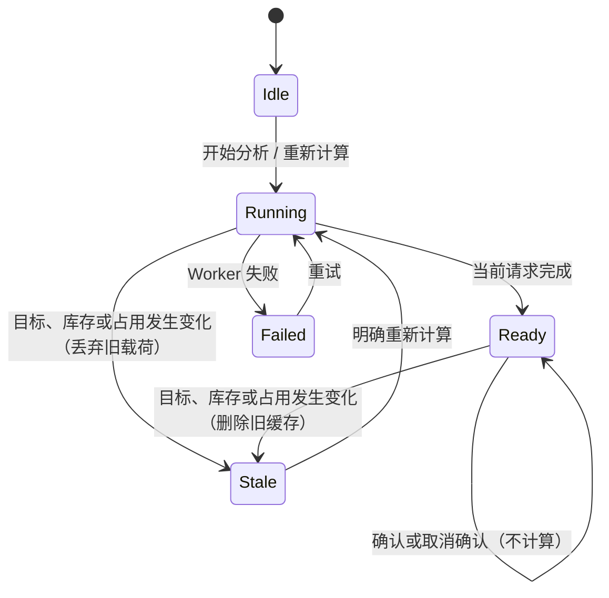

# ADR-0010：方案缓存、因子占用与计算状态机

> 因子占用身份和缓存失效规则已由 [ADR 0012](0012-grouped-factor-inventory.md) 取代。本文件保留为历史设计记录。

状态：Accepted

## 背景

一个存档可以为多个角色计算配装，但同一枚因子不能同时装备给两个角色。结果还需要跨应用重启保存。缓存、占用和计算如果混在 React 事件中，点击确认或切换方案就可能重复启动求解器，也容易让旧请求覆盖新目标。

## 因子身份

系统保留两种标识，不能互相替代：

- `factorInstanceKey` 标识当前存档里的具体因子，由 `gemUnitId + inventorySlotId + 有序主副词条 hash` 组成。占用台账只认这个标识。
- `factorFingerprint` 由 `主词条 hash + 副词条 hash + 因子等级` 组成，只用于分组、显示和快速诊断。

“同类因子的第几个”不进入长期身份。删除或新增一枚同类因子会改变后续序号，旧确认记录可能因此指向另一枚物品。库存更新后，系统只按实例标识核对；找不到就标记缺失，不自动换成同词条因子。

## 本地数据

每个命名方案使用稳定 `profileId`，名称只是可修改的显示字段。记录包括：

- 当前目标草稿；
- 最近一次成功或无解的分析结果；
- 计算时的目标、库存和排除实例指纹；
- 随机种子和计算时间；
- 已确认结果的唯一显示名、确认时目标/结果快照与具体实例标识。

分享字符串只包含名称和目标，不包含库存、结果或占用记录。

## 计算状态机

只有“开始分析”和“重新计算”启动 Web Worker。以下操作不启动求解器：

- 编辑目标或方案名称；
- 切换方案；
- 导入或重新读取存档；
- 确认配装、取消确认；
- 在结果标签之间切换。

运行中的请求带有单调 `runId` 和完整 `requestKey`。请求返回时两者必须仍与当前状态一致，否则丢弃结果。用户修改目标、导入库存或切换方案时，如果 Worker 仍在计算，Renderer 会终止该 Worker；下一次明确分析时再创建新 Worker，避免无效计算占用 CPU。

## 缓存键与更新时间

缓存键由 `GBFR-RANK-4 + 规范化目标 + 库存指纹 + 其他方案已占用实例集合` 组成。方案名称不参与。RANK-4 调整了目标外副词条的方案身份；旧分析缓存直接失效，目标草稿继续保留。

- 目标草稿停止变化 500 毫秒后自动保存。
- 只有成功或无解结果能原子替换缓存。
- 失败和过期请求不覆盖旧结果。
- 名称变化不使结果过期。
- 目标或库存变化时，失效分析从持久化工作区中删除；状态仍显示“需要重新计算”，但不保留不可确认的旧结果载荷。
- 新增占用只在命中缓存前十名所使用的具体实例时使该缓存过期；没有命中时排名不变，可以继续使用。
- 释放占用可能让更优候选重新进入前十名，因此相关缓存保守删除。
- 应用尚未读取库存时无法验证库存指纹，只保留已加载工作区，不据此误删；下一次读取库存时立即清理不匹配缓存。
- 每个方案最多保存一份 Top-10 分析，不按计算次数创建历史文件。旧 `profiles.v2` 键在成功写入 v3 工作区后删除。
- 每个排名结果最多保存一个手动调整版。调整只做本地重新评估，不启动求解器；重新分析会随 Top-10 一起替换这些调整版。

## 库存快照

主进程在一次手动导入成功后，原子覆盖一份解析后的库存快照。它只包含因子 DTO、解析诊断、源文件显示名、读取时间和仅供下次文件选择框使用的源路径。

- 应用启动只读取这份应用数据，不打开、校验或监视原游戏存档。
- 再次手动选择并成功解析后才更新；取消选择或解析失败保留上一份可用快照。
- 源绝对路径不发送给 Renderer，不进入日志、目标方案、分享字符串或诊断包。
- 解析仍使用临时副本，结束后删除；不长期保存原始存档副本。
- 应用内不提供存档备份，仅提示用户在游戏外自行备份。

## 确认配装

确认操作不重新求解。它按下面的顺序执行：

1. 确认当前显示的是可用缓存结果；
2. 检查结果中的实例是否仍在当前库存；
3. 检查是否被其他已确认方案占用；
4. 一次性替换当前方案的旧占用记录；
5. 删除使用了新占用实例的其他方案缓存。

若与另一个已确认方案冲突，操作停止并列出方案名称。用户必须先取消旧配装。未确认的缓存不会阻止确认；使用了新占用实例的缓存会被删除并进入需要重算状态。

已确认配装使用独立只读入口展示。名称在确认时分配首个未使用的后缀；确认记录保留目标和结果快照，因此之后编辑来源方案不会改写旧配装的替代提示。打开、切换或关闭该入口都不触发求解。

## 后果

- 同词条、同等级的其他因子仍可用于别的角色。
- 确认操作只做集合检查和本地写入，复杂度与已缓存结果数量成线性关系，不会锁住求解器。
- 库存刷新后不会悄悄替换已确认实例。
- 有效结果缓存可以直接打开；失效结果不再占用本地存储。
- 求解 Worker 在每次完成、失败、取消或页面退出时终止并清空 pending request，释放动态规划堆；只有下一次明确分析才重新创建。
