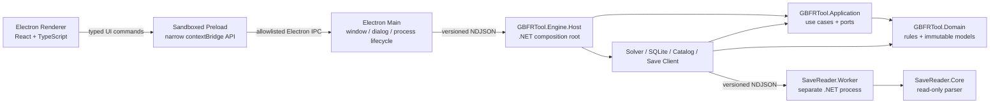
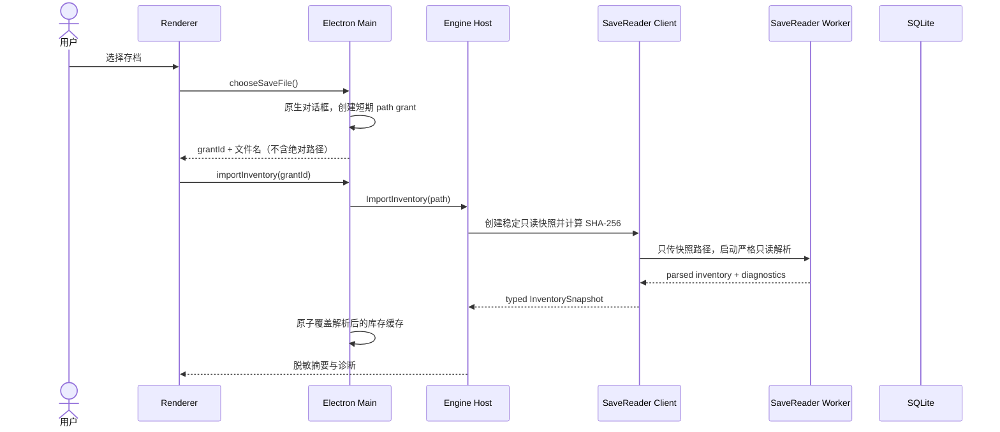

# GBFR 因子配装工具软件架构

> 实现状态说明（2026-07-22）：本文保留最初的完整 Engine 目标架构，便于追溯。首个可运行版本已按 [ADR-0009](adr/0009-pure-worker-solver-and-local-profiles.md) 收敛：C# Engine/独立 Worker 只负责不可信存档解析；精确求解器是无文件系统权限的纯 TypeScript Web Worker；方案 codec/存储经独立 domain 模块封装并使用浏览器本地存储。下文中“Engine 持有求解、Catalog、SQLite 和草稿”的段落属于被 ADR-0009 取代的原计划，不是当前运行时事实。

## 1. 已确认的技术边界

桌面端正式采用 Electron，Windows 是必须发布的平台，macOS 用于当前开发和可选发布。Electron 只替换界面外壳；现有 C# 领域模型、排序、求解、Catalog、SQLite 和只读存档解析继续作为独立 .NET 引擎运行。

首版围绕以下质量属性设计：

| 属性 | 可检查的约束 |
|---|---|
| 低耦合 | Renderer 不依赖 Node、Electron、文件系统或 C# DTO；Domain 与 Contracts 不依赖第三方包；外部技术只实现 Application 端口 |
| 可维护 | 游戏版本变化限制在 SaveReader、Catalog 或对应 adapter；换肤和交互修改限制在 Renderer；业务规则不读取 React、Electron、数据库或进程 API |
| 易调试 | 每次导入/分析都有 correlation ID；同一库存 hash、请求、Catalog 版本和 run seed 可重放；Electron Main、Engine Host 和 SaveReader Worker 都可单独自检 |
| 安全 | Renderer 沙箱化且没有 Node 权限；存档只对稳定快照读取；应用不加载远程页面，不写回源存档 |
| 跨平台 | 同一 Renderer/Main 代码运行于 Windows 和 macOS；平台相关行为集中在 Main 与发布脚本；.NET 引擎按 RID 打包 |

MVP 不开放第三方插件，不加载第三方程序集，不提供任意文件读取或通用 IPC 通道。

## 2. 进程与依赖方向

采用端口与适配器，并把不可信存档解析放在第二层进程隔离中。



箭头表示调用或编译依赖。Renderer 只能看到面向界面的 ViewModel 和命令结果；Electron Main 不包含配装规则；Engine Host 是唯一 C# 组合根；SaveReader Worker 不连接应用数据库。

## 3. 目标目录与职责

```text
desktop/
  src/main/                 Electron 生命周期、窗口、原生对话框、Engine 进程管理
  src/preload/              每个用例一个窄 contextBridge 方法
  src/renderer/             React UI、ViewModel、设计令牌、页面状态
  src/shared/               生成的 TypeScript 合同与纯工具
contracts/desktop/v1/       Main ↔ Engine 的版本化 JSON Schema 和黄金样本
src/
  GBFRTool.Domain/
  GBFRTool.Application/
  GBFRTool.Engine.Host/
  GBFRTool.Contracts/
  GBFRTool.SaveReader.Core/
  GBFRTool.SaveReader.Worker/
  GBFRTool.Infrastructure.*/
tests/
```

| 模块 | 职责 | 禁止事项 |
|---|---|---|
| Renderer | 目标编辑、库存摘要、结果解释、命名方案切换 | `fs`、`child_process`、原始 IPC、SQL、求解和存档规则 |
| Preload | 用 `contextBridge` 暴露逐项、参数受限的 API | 暴露 `ipcRenderer`、Node 对象、任意 channel 或回调事件对象 |
| Electron Main | 窗口、文件选择、路径授权令牌、Engine 生命周期、协议转发 | 存档解析、业务排序、直接写 SQLite、远程页面 |
| `GBFRTool.Engine.Host` | .NET 组合根、桌面协议、用例分发、事件与取消 | UI 状态、网页资源、直接解析 FlatBuffers |
| Domain | Skill、Sigil、Inventory、BuildRequest、BuildResult 和纯规则 | UI、文件、数据库、日志、IPC、OR-Tools |
| Application | 用例编排、端口、错误模型、操作上下文 | 具体存档字段、SQL、Electron、进程启动 |
| Desktop Contracts | 跨运行时消息 schema、协议版本、黄金样本 | 业务行为、数据库实体、绝对文件路径回传给 Renderer |
| SaveReader Core/Worker | 只读解析快照、协议握手和解析 DTO | 写回存档、访问主数据库、业务排序 |
| Infrastructure adapters | Solver、SQLite、Catalog、稳定快照和 Worker client | UI 状态；adapter 之间互相引用 |

现有 `GBFRTool.App` WPF 骨架是被替换的旧启动项目，不属于目标架构。只有在本架构通过最终审阅后，才移除该项目并创建 Electron/Engine Host，避免迁移中途留下两个有效组合根。

## 4. 合同与状态模型

### 4.1 Renderer ↔ Preload ↔ Main

Preload 只暴露业务意图明确的方法，例如：

```ts
interface DesktopApi {
  chooseSaveFile(): Promise<SaveFileGrant | null>;
  importInventory(request: ImportInventoryCommand): Promise<OperationAccepted>;
  analyzeBuild(request: AnalyzeBuildCommand): Promise<OperationAccepted>;
  cancelOperation(operationId: string): Promise<void>;
  loadWorkspace(): Promise<WorkspaceViewModel>;
  saveProfile(request: SaveProfileCommand): Promise<ProfileSummary>;
  subscribeOperationEvents(listener: (event: OperationEvent) => void): Unsubscribe;
}
```

不提供 `send(channel, payload)`、`readFile(path)`、`openExternal(url)` 等通用能力。订阅包装器只把已经验证的业务事件传给 Renderer，不泄露 Electron event 对象。

目标编辑、path grant、能力协商、资源限制和子进程定位的可执行合同见 [Electron 桌面合同](desktop-contracts.md)。该合同优先于本节的示意接口。

### 4.2 Main ↔ Engine Host

标准输入/输出使用 UTF-8 NDJSON，一行一个信封：

```text
protocolVersion, messageType, requestId, correlationId, payload
```

- JSON Schema 是跨 TypeScript/C# 的规范来源；两侧生成类型并在运行时验证入口。
- 请求和响应以 `requestId` 对应；长操作先返回 accepted，再发送进度和完成事件。
- 取消使用显式 `CancelOperation` 消息；不得依赖杀死整个 Engine 作为正常取消。
- 每行和每个字段有长度上限；未知 messageType 返回稳定协议错误，不做动态反射调用。
- 破坏性变化提升 `ProtocolVersion`；新增可选字段保持向后兼容。
- stderr 只输出结构化诊断，stdout 不混入日志。

Main 启动后先执行握手，校验协议、应用版本、Catalog schema 和 Engine 能力。握手失败时 UI 进入可诊断错误页，不尝试分析。

### 4.3 Engine 内部

主要端口保持：`IInventorySource`、`IBuildSolver`、`IInventorySnapshotRepository`、`IBuildProfileRepository`、`ISkillCatalog` 和 `IClock`。`IBuildRequestNormalizer` 与 `ISkillSelectionConflictPolicy` 是 Application 内部纯规则服务；Renderer 只消费它们返回的 `CanAdd`、`CanRemove` 和 typed reason，不能另写一套冲突规则。

## 5. 关键运行时流程

### 5.1 导入库存



path grant 只在 Main 内存中映射到用户通过原生对话框选择的绝对路径，单次使用或短期过期。Renderer 不能自行提交路径。源存档只复制到临时目录供解析；任何 hash mismatch、文件变化或解析异常都返回诊断，绝不修复或写回源文件。成功后只缓存解析 DTO，不保存原始存档副本。

### 5.2 编辑与分析

Engine 持有已验证草稿，Renderer 只持有带 revision 的 ViewModel。`ApplyTargetEdit` 以 `draftId + baseRevision + editId` 串行比较并交换，返回新 revision、动态容量和禁用原因；Renderer 丢弃迟到响应。正式保存/分析再次由 Catalog-aware normalizer 完整校验，避免只信任增量状态。

分析请求引用 `snapshotId`、规范化目标、Catalog 版本和显式 run seed。求解器按 [GBFR-RANK-3](ranking-specification.md) 生成最多 10 个结果以及 canonical assignment witness。结果引用 request hash，切换方案或库存后迟到响应不得覆盖当前页面。

求解属于最坏情况下会组合爆炸的问题。当前精确 DP 每层最多保留 25,000 个语义状态和 50,000 个候选，内部墙钟为 6 秒；Renderer 在 8 秒时终止短生命周期 Worker。任何一个限制触发都返回 `solver.resource_limit`，不返回近似方案、不缓存、不允许确认。普通输入仍保持精确 Top-K 语义；复杂输入应通过减少可选目标或增加“不能出现”的技能缩小搜索空间。后续若替换为整数约束求解器，也必须保留同样的隔离和失败协议。

### 5.3 进程失败与恢复

- Engine Host 意外退出：Main 记录退出码和 correlation ID，最多自动重启一次；未提交的 Renderer 草稿保留，进行中的操作标记失败，不自动重放写入命令。
- SaveReader Worker 超时/崩溃：Engine 终止该 Worker，删除临时快照并保留上次成功的库存缓存；Engine 与 UI 继续可用。
- Solver Worker 达到状态、候选或时间预算：终止 Worker，页面保留当前目标和上一份有效缓存，但本次请求不得覆盖缓存或进入确认流程。
- Renderer reload：通过 `loadWorkspace()` 从 Engine/SQLite 重建已提交状态；临时草稿使用明确的页面级恢复策略，不依赖 Electron Main 内存作为数据库。

## 6. Electron 安全基线

安全设置属于发布门槛，而不是可选优化：

- `contextIsolation: true`、`sandbox: true`、`nodeIntegration: false`、`webSecurity: true`。
- 只加载打包的本地资源，使用受控自定义协议而不是任意 `file://` 页面；不使用 `<webview>`、远程 iframe 或运行时下载代码。
- CSP 至少限制为 `default-src 'self'`，脚本禁止 `unsafe-eval`；样式和图片只开放确有需要的本地来源。
- 拒绝非应用来源的导航、`window.open` 和权限请求；所有 IPC handler 验证 sender frame。
- 不向 Renderer 暴露原始 Electron/Node API；不接收任意 channel、路径、命令行或 URL。
- 发布时评估并锁定 Electron fuses，至少关闭 RunAsNode；生产包关闭 DevTools 快捷入口和调试端口。
- 依赖锁文件必须提交；Electron、Chromium 相关安全更新按固定维护窗口升级并执行回归测试。

依据：Electron 官方要求隔离上下文、启用沙箱、限制导航/新窗口、验证 IPC sender，并建议使用逐方法的 context bridge，而不是暴露原始 `ipcRenderer`。参见 [Security](https://www.electronjs.org/docs/latest/tutorial/security)、[Context Isolation](https://www.electronjs.org/docs/latest/tutorial/context-isolation) 和 [Process Sandboxing](https://www.electronjs.org/docs/latest/tutorial/sandbox)。

## 7. 数据所有权与隐私

- 原始存档：用户所有，应用只读，不纳入 SQLite，不上传网络。
- 临时快照：SaveReader Client 创建；成功或失败后按明确保留策略清理，Worker 无写权限语义。
- 原始存档备份：应用不创建；读取成功后建议用户自行在游戏外备份。
- `InventorySnapshot`：不可变，保存新版本而不原地更新。
- Build Profile：保存稳定 Skill ID、occurrence、顺序、名称和 schema version；分享字符串包含名称但不含库存、路径或玩家身份。
- Catalog：版本化只读数据包；未知 raw hash 原样保留在诊断层，不参与普通选择和求解。
- 日志：不记录原始存档、绝对用户目录、Steam ID、玩家名或完整分享字符串。

### 7.1 解析库存缓存

- 手动读取成功后，以应用数据目录内的临时 JSON 写入并同目录原子 rename，覆盖上一份解析库存。
- 缓存包含因子 DTO、诊断、读取时间、源文件显示名和 Main 私有的上次路径，不包含原始存档字节。
- 应用启动只读取缓存 JSON，不打开源存档。上次路径只用作下一次用户主动打开文件选择框的默认位置。
- 缓存损坏、结构错误或超过大小上限时忽略并提示重新读取；失败导入不覆盖上一份有效缓存。
- Windows 与 macOS 均限制应用数据目录为当前用户；绝对源路径不进入 Renderer、分享字符串或普通日志。

## 8. UI 解耦与设计系统

Renderer 内再分三层：

```text
pages/components  →  UI view-model/store  →  DesktopApi port
       ↓                    ↓
design tokens          pure selectors/reducers
```

- React 组件不直接调用 `window.gbfr`；页面 action 经过可替换的 `DesktopApi` adapter，测试注入内存实现。
- Engine DTO 先映射为 UI ViewModel，组件不依赖协议字段和 C# 类型名。
- 目标编辑器状态机与视觉组件分离；激活、添加、删除、禁用原因和容量计算均可单测。
- 色彩、间距、字体、状态和组件变体由 `design-system/` 与 CSS variables 提供，页面不得散落十六进制色值。
- 具体交互见 [目标配置交互规格](block-pool-ui.md)。

## 9. 构建、发布与调试

桌面外壳使用 React + TypeScript + Electron Forge 的官方 Webpack TypeScript 路线；当前官方 Vite 插件仍标记 experimental，因此首版不以它作为发布基线。Electron 官方推荐 Forge 进行打包和分发，参见 [Application Packaging](https://www.electronjs.org/docs/latest/tutorial/application-distribution/) 和 [Forge React + TypeScript](https://www.electronforge.io/guides/framework-integration/react-with-typescript)。

工具链在脚手架提交中一次性钉住：根目录 `.node-version` 记录当时受支持的 Node LTS 精确版本；`package.json.packageManager` 固定 npm 精确版本；Electron、Forge、React、TypeScript 和构建插件使用精确版本并提交 `package-lock.json`，CI 只运行 `npm ci`。`.NET` 继续由根目录 `global.json` 固定 SDK feature band/RID。依赖升级单独提交，并运行合同、E2E、打包和安全回归，不能在普通功能提交中隐式漂移。

- `npm run dev` 启动 Electron 和 Development Engine；Engine 可单独 `dotnet run` 并读取协议夹具。
- Forge 打包前先为目标 RID 发布 self-contained .NET Engine/Worker，再作为只读 resource 纳入安装包。
- Windows 首发至少生成 x64 安装包；macOS arm64 用于当前调试，可在通过签名/公证流程后作为可选产物。
- Windows 和 macOS 分别在对应 OS CI 构建、签名和冒烟测试，不依赖跨平台签名。
- MVP 不自动更新；稳定发布和签名流程验证后再通过单独 ADR 引入更新通道。

结构化日志按进程分流，但共享 `correlationId`。开发模式可开启 Renderer DevTools；生产诊断页只展示版本、协议状态、Catalog 版本、进程健康和脱敏错误码。诊断包由 Engine/Main 明确挑选文件生成，不递归打包用户目录。

## 10. 测试与发布闸门

| 层级 | 必测内容 |
|---|---|
| Domain | multiset、主副顺序、去重、排序属性和小规模穷举 oracle |
| Application | 用例、冲突策略、动态容量、错误码和旧配置修复 |
| SaveReader | 用户样本的只读快照、hash、未知字段、崩溃/超时和源文件未变化断言 |
| Contracts | JSON Schema、C#/TS 生成漂移、黄金消息、协议不兼容和大小限制 |
| Renderer | 状态机、重复策略、键盘、tooltip、迟到响应和设计令牌快照 |
| Main/Preload | sender 校验、path grant、channel allowlist、导航/CSP 和 Engine 重启 |
| E2E | Electron + Engine 的导入夹具、测试方案、Top-10、保存/切换/分享 |
| Packaging | 干净 Windows VM 安装启动、资源定位、无开发依赖、签名和卸载 |

每个发布候选还必须通过：架构依赖守卫、格式检查、许可证/依赖审计、Catalog 准入测试、源存档 hash 前后相同、无网络请求检查和实现后的对抗式审查。

## 11. 迁移顺序

1. 最终审阅本架构、桌面合同、目标交互和最新版 Catalog 审计；先关闭所有架构 P1。
2. 使用只含 `test.*` 稳定 ID 的合成 Catalog 增加 Desktop JSON Schema 与 `GBFRTool.Engine.Host`，完成握手、编辑 revision、path grant 和重放夹具。该阶段不能读取真实存档或生成正式分享字符串。
3. 创建 Electron Main/Preload/Renderer 安全骨架和组件测试；新骨架验证可启动后再删除旧 WPF 组合根。
4. 独立完成 Ver. 2.0.2 Catalog 提取与准入。正式 Catalog 的 P0 未关闭前，禁止接入真实 Skill hash、发布用户可见目录或固化真实 profile 数据；但不阻止第 2～3 步的纯基础设施实现。
5. 接通现有 Application/Domain、SQLite 与已过闸 Catalog adapter，并迁移旧五域 C# 骨架为最终八域合同。
6. 完成严格只读真实存档 PoC；成功则作为正式入口，失败才启动 CV adapter。
7. 实现测试方案、求解器、命名配置和带名称的分享字符串。
8. 在 Windows/macOS 完成 E2E、打包验证、正式 Catalog/只读闸门和实现后的对抗式审查。

这里区分“基础设施开工闸门”和“产品数据/发布闸门”：合成 Catalog 只能服务合同和 UI 状态机测试，命名空间固定为 `test.*`，不得迁移成正式数据。未经准入的社区名称、分类、hash 和翻译不能进入产品资源、持久化 schema 或分享样本。

新增外部技术必须通过新 adapter 接入；只有出现第二个真实实现或现有接口妨碍测试时才继续拆分端口，避免为假想扩展制造层级。
